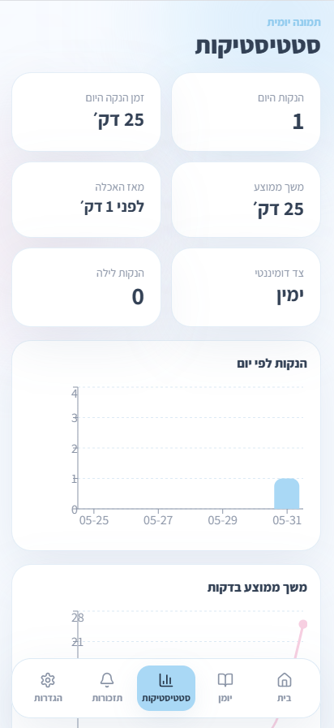

# Feedly Baby

Feedly Baby is a Hebrew RTL breastfeeding tracking app designed for calm, low-friction daily use. It helps parents record breastfeeding sessions, pumping, bottles, and diapers, review recent activity, and keep track of the next reminder without relying on a backend.

The app runs as both a React web app and a locally installable Android APK using Capacitor.

## Main Features

- Hebrew RTL interface with a mobile-first layout
- Breastfeeding timer with side tracking, pause, resume, side switching, and quick night saves
- Persistent active breastfeeding timer that survives navigation and app restarts
- Dashboard recovery actions for an unfinished active timer
- Logs for breastfeeding, pumping, bottles, and diapers
- Editable Jerusalem time defaults for pumping, bottle, and diaper entries
- Daily statistics and charts for feeding activity, side usage, pumping, and bottles
- Calm night mode with improved low-light contrast
- Morning review flow for incomplete night sessions
- Android local notifications for breastfeeding and pumping reminders
- JSON data export and local reset controls

## Screenshots

| Dashboard | App Screen |
| --- | --- |
|  |  |
|  |  |
|  |  |
|  |  |

## Tech Stack

- React
- TypeScript
- Vite
- Tailwind CSS
- Framer Motion
- Recharts
- Lucide React
- Capacitor Android
- Capacitor Local Notifications
- LocalStorage

## Local Development

Install dependencies and start the Vite development server:

```bash
npm install
npm run dev
```

Vite will print the local development URL in the terminal.

## Web Build

Create a production web build:

```bash
npm run build
```

The generated static files are written to `dist/`.

## Android APK Build

Feedly Baby uses Capacitor with the Android package ID `com.feedlybaby.app`. The Android build is intended for local manual installation, not Play Store release.

Build the web app, sync the Android project, and create a debug APK:

```bash
npm install
npm run build
npx cap sync android
cd android
./gradlew assembleDebug
```

On Windows PowerShell:

```powershell
npm install
npm run build
npx cap sync android
$env:JAVA_HOME = "C:\Program Files\Android\Android Studio\jbr"
cd android
.\gradlew.bat assembleDebug
```

The debug APK is generated at:

```text
android/app/build/outputs/apk/debug/app-debug.apk
```

To open the native Android project in Android Studio:

```bash
npx cap open android
```

## Data Storage

The current version stores baby details, sessions, reminders, settings, and active timer state locally using browser LocalStorage. The same approach is used inside the Capacitor Android app.

There is currently no Firebase integration, account system, cloud backup, or multi-device sync.

## Android Notifications

Android reminders use `@capacitor/local-notifications`. The app requests notification permission when needed and schedules the next local notification for active breastfeeding and pumping reminders.

Reminder scheduling is based on the latest relevant session:

- Breastfeeding reminders count from the latest completed feeding end time.
- Pumping reminders count from the latest pumping session time.
- Saving a new relevant session resets the active reminder countdown.
- Disabling or deleting a reminder cancels its scheduled notification.
- When no relevant session exists yet, the reminder waits for the first feeding or pumping session.

The web version handles the absence of native notification APIs gracefully.

## Vercel Deployment

The web app can be deployed to Vercel as a standard Vite project:

```text
Build command: npm run build
Output directory: dist
```

Android notification behavior is native-only and is not available in the hosted web build.

## Future Improvements

- Optional Firebase or another cloud sync layer
- User accounts and secure backup
- Background rescheduling for recurring arbitrary-minute Android reminders after notification delivery
- Release signing and store distribution preparation
- Additional automated tests for timer recovery and reminder scheduling
